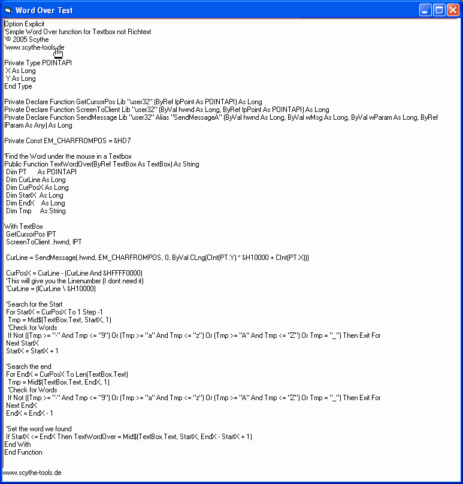

## WordOver for Standard Textbox

### Description

Add WordOver function to Standard Textboxes (not to Richtext)
 
### More Info
 

             |
---                |---
**Submitted On**   |2005-08-09 17:18:04
**By**             |[Scythe](https://github.com/Planet-Source-Code/PSCIndex/blob/master/ByAuthor/scythe.md)
**Level**          |Advanced
**User Rating**    |5.0 (25 globes from 5 users)
**Compatibility**  |VB 5\.0, VB 6\.0
**Category**       |[Custom Controls/ Forms/  Menus](https://github.com/Planet-Source-Code/PSCIndex/blob/master/ByCategory/custom-controls-forms-menus__1-4.md)
**World**          |[Visual Basic](https://github.com/Planet-Source-Code/PSCIndex/blob/master/ByWorld/visual-basic.md)
**Archive File**   |[WordOver\_f201881982006\.zip](https://github.com/Planet-Source-Code/scythe-wordover-for-standard-textbox__1-66508/archive/master.zip)

